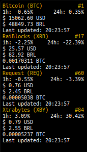

# conky-crypto
Conky with my Portfolio cryptocurrency

## Installation
- Clone repo `git clone https://github.com/deyvisonrocha/conky-crypto.git ~/.conky/crypto`
- Install Python dependencies:
  - babel.numbers
- Use Conky Manager to autostart when login

## Donate

### Bitcoin
1HFL4DbTkfg7nWjkUkhy9jEoQrRCzvSACp

### Nano
nano_1rr7k8cricgwosbeqr6rq1kjjwd9fkyyzmufbm3wini7wuw5117uiferocha
